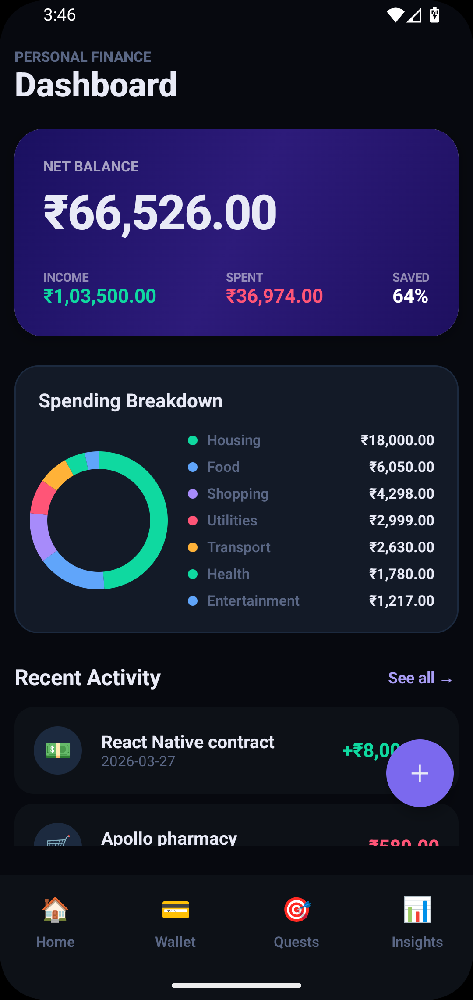
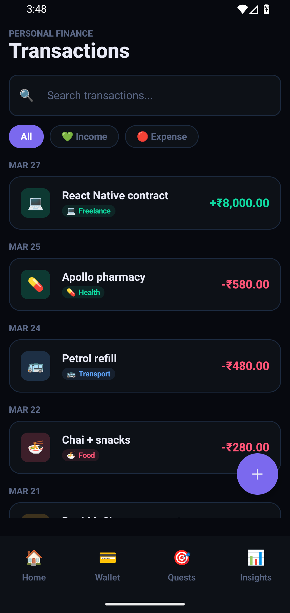

 

<table>
  <tr>
    <td align="center">
      
       <b>Dashboard</b>
    </td>
    <td align="center">
      
       <b>Transactions</b>
    </td>
    <td align="center">
      
       <b>Money Quests</b>
    </td>
    <td align="center">
      
       <b>Add Funds</b>
    </td>
  </tr>
  <tr>
    <td align="center">
      
       <b>Insights</b>
    </td>
    <td align="center">
      
       <b>Spending by Category</b>
    </td>
    <td></td>
    <td></td>
  </tr>
</table>

 
